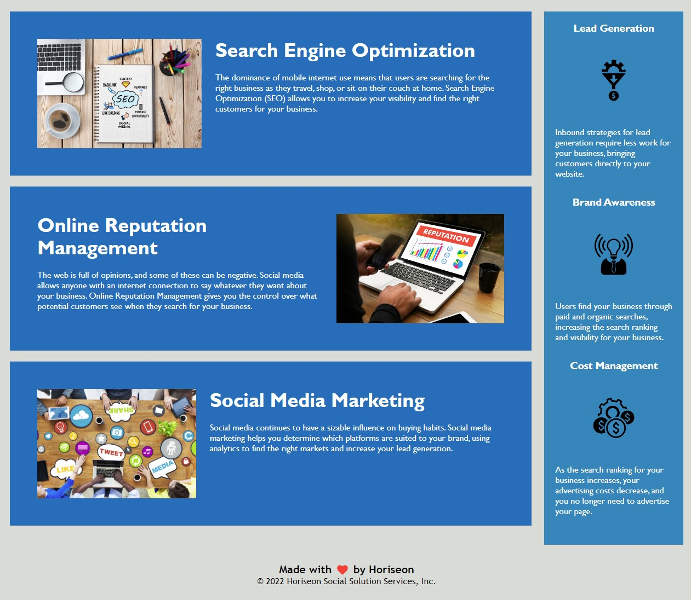

# Assignment1

<!--Project Information-->
UW Coding Bootcamp Assignment 1- Refactoring starter code, creating semantic HTML and CSS, organizing the CSS to match the order of the HTML, and adding comments.

<!--Web Page link-->
https://snovelli1021.github.io/Assignment1/

<!--Inserting screenshots using markdown insert image-->

